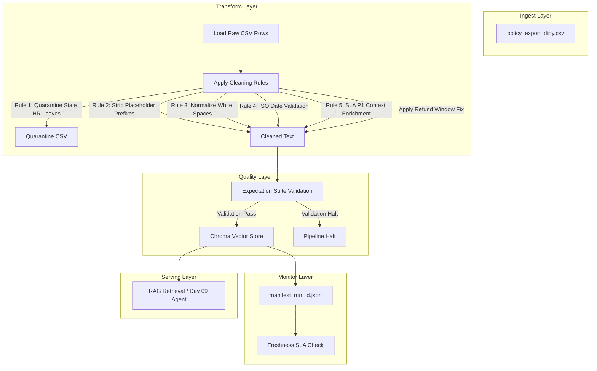

# Kiến trúc pipeline — Lab Day 10

**Nhóm:** Cá nhân (Nguyen Ho Dieu Linh — MSV: 2A202600567)  
**Cập nhật:** 2026-06-10

---

## 1. Sơ đồ luồng

---

## 2. Ranh giới trách nhiệm

| Thành phần | Input | Output | Owner nhóm |
|------------|-------|--------|--------------|
| **Ingest** | `data/raw/policy_export_dirty.csv` | List of raw rows | Nguyen Ho Dieu Linh |
| **Transform**| List of raw rows | Cleaned CSV & Quarantine CSV | Nguyen Ho Dieu Linh |
| **Quality** | Cleaned rows | Validation reports (PASSED/FAILED) | Nguyen Ho Dieu Linh |
| **Embed** | Cleaned CSV | Chroma collection `day10_kb` | Nguyen Ho Dieu Linh |
| **Monitor** | `manifest_run_id.json` | Freshness SLA status & alerts | Nguyen Ho Dieu Linh |

---

## 3. Idempotency & rerun

- **Chiến lược:** Việc ghi dữ liệu (Embed) được thiết kế có tính **idempotent** bằng cách sử dụng phương thức `upsert()` của ChromaDB dựa trên khóa duy nhất `chunk_id` (được tạo bằng hàm hash SHA-256 từ `doc_id`, `chunk_text`, và số thứ tự `seq`).
- **Pruning (Dọn dẹp):** Để tránh việc dữ liệu cũ (stale vectors) còn sót lại trong database khi số lượng dòng cleaned giảm đi, pipeline thực hiện quét các ID cũ trong collection và xóa (`delete(ids=drop)`) bất kỳ vector ID nào không nằm trong tập cleaned của lượt chạy hiện tại. Do đó, việc chạy lại (rerun) nhiều lần hoàn toàn không làm phình tài nguyên hay lưu trữ trùng lặp.

---

## 4. Liên hệ Day 09

- Pipeline này đóng vai trò cung cấp dữ liệu nền (Knowledge Base) sạch cho hệ thống Multi-agent của Day 09.
- Bằng cách đảm bảo dữ liệu trong ChromaDB đã được lọc bỏ các thông tin lỗi thời (chính sách nghỉ phép 10 ngày cũ của năm 2025, cửa sổ hoàn tiền 14 ngày cũ), RAG Agent của Day 09 sẽ truy xuất được các chunk tài liệu chính xác (quy định nghỉ phép 12 ngày của năm 2026, hoàn tiền 7 ngày làm việc). Điều này ngăn chặn hoàn toàn việc Agent trả lời sai do dữ liệu mâu thuẫn hoặc stale.

---

## 5. Rủi ro đã biết

- **Lệch múi giờ (Timezone skew):** Dữ liệu xuất từ các hệ thống nguồn khác nhau có thể sử dụng múi giờ khác nhau, dễ gây sai sót khi tính toán Freshness SLA.
- **Thay đổi định dạng tài liệu nguồn:** Nếu các hệ thống nguồn thay đổi định dạng hoặc cấu trúc cột xuất mà không cập nhật schema trong `data_contract.yaml`, pipeline sẽ kích hoạt halt do lỗi schema.
- **Tốc độ embedding trên CPU:** Chạy SentenceTransformer trên CPU đối với các bộ dữ liệu cực lớn có thể gây nghẽn băng thông pipeline. Trong lab này quy mô nhỏ (~36 chunks) nên hoàn toàn đáp ứng được.
